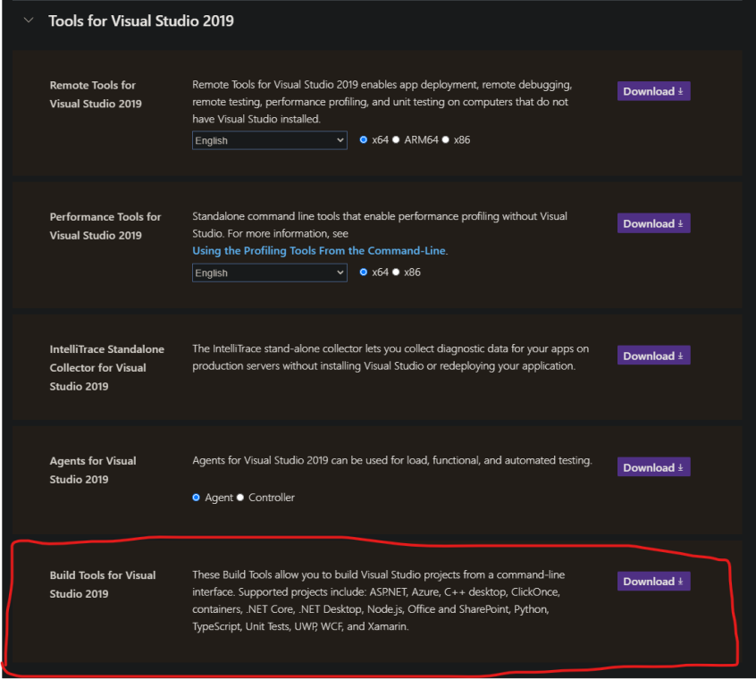

# DQN Model Playing The Mountain Car Game


## Introduction

In this project, I created a Deep Q-Learning that reaches the goal of the Mountain Car Game. It trained for 1 million steps and reached the result you see above.

## Installation
*These steps helps you install OpenAi Gym in a Windows Environment. If this isn't your case, you can follow a similar approach suited to your OS.*

*These steps are based on this [tutorial](https://towardsdatascience.com/how-to-install-openai-gym-in-a-windows-environment-338969e24d30)*


Install Microsoft Visual C++ Build Tools for Visual Studio 2019 [here](https://visualstudio.microsoft.com/downloads/):




Using [conda](https://docs.conda.io/en/latest/), create an env.

```bash
conda create -n env_name python=3.8 pip
```

```bash
conda activate env_name
```

Then, install the necessary packages:

Minimum install of OpenAI Gym:

```bash
pip install gym
```

Package to run the ToyText Environments:

```bash
conda install pystan
```

To use Git:

```bash
conda install git
```

To run the Atari environments:

```bash
pip install -f https://github.com/Kojoley/atari-py/releases atari_py
```

To run the Box2D environments:

```bash
conda install swig
pip install Box2D
```

Install [Xming](https://sourceforge.net/projects/xming/) to display your model playing with the envs.

## Usage

You can train a model, view a model in action, and generate a gif directly from the command-line:

Trains a model using the hyperparameters defined on src/config.py. You can also specify a model_name as an argument (should include the extension ".pt").
```bash
python -m src.train -model_name my_model.pt
```

View a model in action. You can specify the model_name (it should be one from the models folder). Must have Xming installed on your computer. 
```bash
python -m src.show_model -model_name my_model.pt
```

Generate Gif. You can specify the model_name (it should be one from the models folder) and the name of the gif file (should include the extension ".gif").
```bash
python -m src.generate_gif -model_name my_model.pt -gif_name my_gif.gif
```

## Contributing

Pull requests are welcome. For major changes, please open an issue first to discuss what you would like to change.

## Questions?


Send me a message at: https://www.linkedin.com/in/gustavobruno-developer/

## License

[MIT](https://choosealicense.com/licenses/mit/)